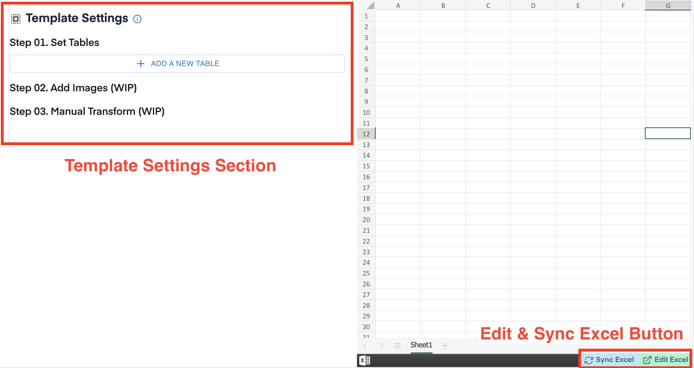
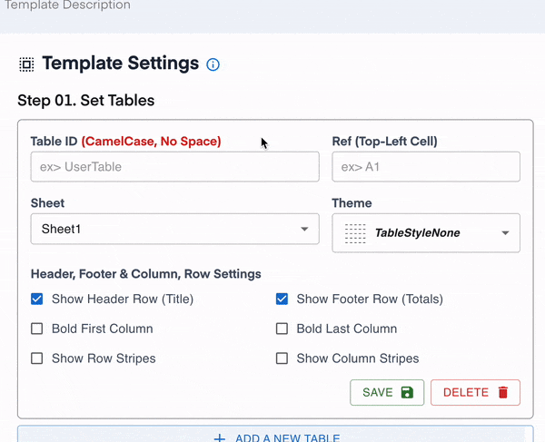
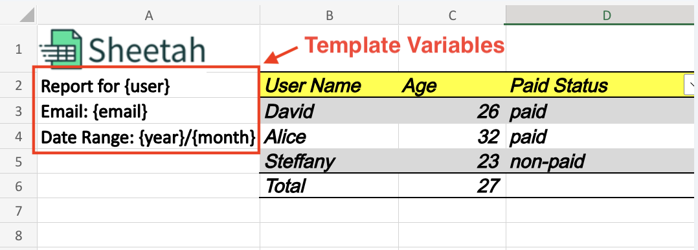

# Sheetah Node.js SDK


Sheetah is a Node.js library that streamlines the process of exporting Excel files using the [sheetah.io](https://sheetah.io/) service. Sheetah empowers you to generate Excel files from your data and templates quickly and effortlessly.

## Installation

To install Sheetah, you can use npm with the following command:

```shell
npm install sheetah
```

## Getting Started

To get started with Sheetah, you must obtain your API key from the [Developer Settings Page](https://app.sheetah.io/). This library can then be used to export Excel files with your data:


```javascript
const Sheetah = require("sheetah");

const API_KEY = "YOUR_API_KEY";
const sheetah = new Sheetah(API_KEY);
```

## Usage

Sheetah offers a straightforward and flexible API for exporting Excel files. Here's a step-by-step guide:

### 1. Setting the Template ID

The `setTemplateId` method is used to designate the template ID for your Excel file export:

```javascript
sheetah.setTemplateId(35);
```

### 2. Setting the Tables

You can add tables to your Excel file using the `setTables` method:

```javascript
sheetah.setTables([
  {
    id: "table1",
    columns: [
      { name: "Column 1", filter: false, totalFormula: "none" },
      { name: "Column 2", filter: true, totalFormula: "average" },
    ],
    rows: [
      ["Row 1", "Data"],
      ["Row 2", "More Data"],
    ],
  },
]);
```

Table settings must be completed on the [Template Settings Page](https://app.sheetah.io/templates).





### 3. Setting Variables

You can set variables for the sheet using the `setVariables` method. This is useful for dynamic data insertion:



```javascript
sheetah.setVariables({
  user: "Dave",
  email: "admin@example.com",
  year: "2019",
  month: "08",
});
```

### 4. Setting the Filename

Use the `setFilename` method to specify your desired filename for the exported Excel file:

```javascript
sheetah.setFilename("Survey Results");
```

### 5. Adding Sheets

To add sheets to your Excel file use the `setSheetInfo` method. The sheet's name and optional direct data can be provided:

```javascript
sheetah.setSheetInfo({
  id: 1,
  name: "Budget",
  directData: {
    A1: "This is cell A1 on Budget sheet",
  },
});

sheetah.setSheetInfo({
  id: 2,
  name: "Expenses",
  directData: {
    B2: "This is cell B2 on Expenses sheet",
  },
});
```

Both "name" and "directData" are optional fields. This step can be skipped if no changes need to be made to the sheet names or direct data.

### 6. Setting the Password

You can protect your Excel file using the `setPassword` method:

```javascript
sheetah.setPassword("mypassword");
```

### 7. Setting the Expiration Days

You can set the expiry date of the URL that gets generated by using the `setExpireInDays` method:

```javascript
sheetah.setExpireInDays(7);
```

### 8. Performing the Export

To export your Excel file, use the `export` method:

```javascript
(async () => {
  const result = await sheetah.export();

  if (result.message === "success") {
    console.log("Download URL:", result.staticFileUrl);
  } else {
    console.log("Download Failed:", result.message);
  }
})();
```

## Contributing

Contributions to Sheetah are welcome! If you'd like to contribute to this project, please follow these guidelines:

1. Fork the repository.
2. Create a branch for your feature or bug fix.
3. Make your changes and commit them.
4. Create a pull request with a detailed description of your changes.

## License

This project is licensed under the MIT License

_Note:_ Make sure to replace `'YOUR_API_KEY'` with your actual API key when using the library.
