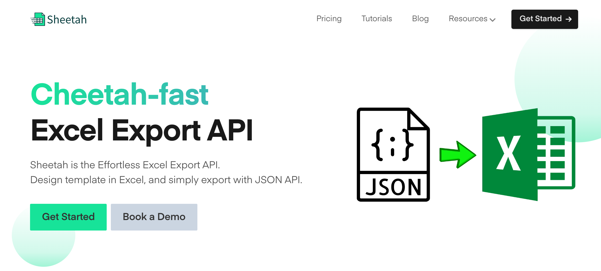
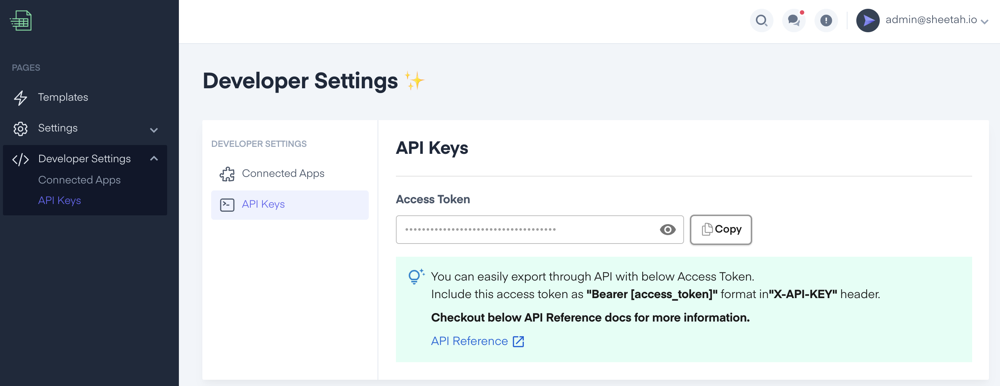

# Sheetah Node.js SDK



Sheetah is a Node.js library that streamlines the process of exporting Excel files. With the [sheetah.io](https://sheetah.io/) service, you can generate Excel files from your data and templates fast and effortlessly.

## Installation

Install Sheetah using npm:

```shell
npm install sheetah
```

## Getting Started

First, obtain your API key from the [Developer Settings Page](https://app.sheetah.io/). Then use the following code to initialize Sheetah:



```javascript
const Sheetah = require("sheetah");

const API_KEY = "YOUR_API_KEY";
const sheetah = new Sheetah(API_KEY);
```

## Usage

Follow these steps to export an Excel file using Sheetah:

### Step 1: Generation

#### 1.1. Setting the Template ID

Specify the template by using `setTemplateId` method:

```javascript
sheetah.setTemplateId(35);
```

#### 1.2. Setting the Tables

Add tables with the `setTables` method:

```javascript
sheetah.setTables([
  {
    id: "table1",
    columns: [
      { name: "Column 1", filter: false, totalFormula: "none" },
      { name: "Column 2", filter: true, totalFormula: "average" },
    ],
    rows: [
      ["Row 1", "Data"],
      ["Row 2", "More Data"],
    ],
  },
]);
```

#### 1.3. Setting Variables

Use the `setVariables` method to add dynamic data:

```javascript
sheetah.setVariables({
  user: "Dave",
  email: "admin@example.com",
  year: "2019",
  month: "08",
});
```

#### 1.4. Setting Sheets

Use the `setSheets` method to add sheets:

```javascript
sheetah.setSheets([
  {
    id: 1,
    name: "Budget",
    directData: {
      A1: "This is cell A1 on Budget sheet",
    },
  },
  {
    id: 2,
    name: "Expenses",
    directData: {
      B2: "This is cell B2 on Expenses sheet",
    },
  },
]);
```

#### 1.5. Setting Options

With `setOptions` you can specify filename, password, and expiration days:

```javascript
sheetah.setOptions({
  filename: "Survey Results",
  password: "mypassword",
  expireInDays: 7,
});
```

### Step 2: Export

#### 2.1. Export to File URL

Export your file to a downloadable URL with `exportExcelToFileUrl` method:

```javascript
(async () => {
  const result = await sheetah.exportExcelToFileUrl();

  if (result.message === "success") {
    console.log("Download URL:", result.fileUrl);
  } else {
    console.log("Download Failed:", result.message);
  }
})();
```

#### 2.2. Export to Buffer

Alternatively, you can also export the sheet and get it as a byte array using `exportExcelToBuffer` method:

```javascript
(async () => {
  const result = await sheetah.exportExcelToBuffer();

  if (result.buffer) {
    // Do something with result.buffer
  }
})();
```

#### 2.3. Export to File

Lastly, you can also save the exported sheet as a local file:

```javascript
(async () => {
  const result = await sheetah.exportExcelToFile("/path/to/file.xlsx");

  if (result.file) {
    console.log("Downloaded file =", result.file);
  }
})();
```

## Contributing

Contributions are welcomed. If you are interested, please fork the repository and make your changes. A detailed description of your changes when making a PR is appreciated.

## License

This project is licensed under the MIT License.

\_Note: Don't forget to replace `'YOUR_API_KEY'` with your actual API key when using the library.
